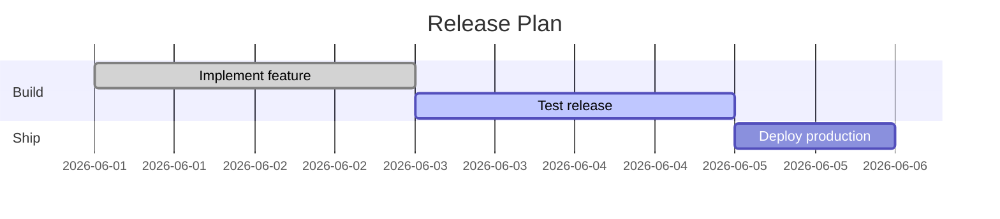

# Mermaid Gantt Chart Agent Guide

This public template accepts official Mermaid `gantt` diagram syntax. Author Mermaid text in the `examples/basic.mmd` style and pass `.mmd` files to visual commands.

## When to use this template

Use this template when the requested diagram is a Mermaid Gantt Chart or an equivalent diagram that Mermaid documents under its Diagram Syntax.

## Semantic model

- Mermaid source = user-authored diagram contract.
- Nodes, participants, events, or chart items are inferred from Mermaid syntax.
- Mermaid labels become visual labels.
- Mermaid relationships become directional visual links when the syntax expresses direction.

## Required construction rules

1. Write valid official Mermaid syntax.
2. Keep labels short and human-readable.
3. Use Mermaid arrows or relationships when direction matters.
4. Use Mermaid frontmatter `title` for the artifact title.
5. Use optional `efp` frontmatter only for visual hints such as template override, renderHints, view, camera, and visual focus.

## Recommended fields

Prefer plain Mermaid. Add EFP frontmatter only when the diagram needs first-view focus, isometric camera hints, route hints, or label density guidance.

## Visual encoding rules

The CLI maps Mermaid syntax to a local offline renderer. Pure Mermaid is always accepted; richer effects depend on what the Mermaid syntax can express.

## Common mistakes to avoid

- Author Mermaid text only.
- Do not embed external URLs or remote images.
- Do not generate JavaScript or CSS.
- Do not use long labels that make the first view unreadable.

## Quality checklist before render

- Mermaid parses as a recognized official diagram kind.
- Important relationships use explicit Mermaid arrows or relations.
- The title is meaningful.
- The first view can be understood without opening raw data.

## Minimal good example

